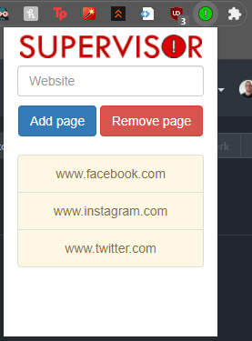
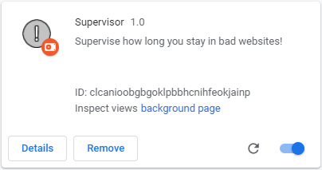
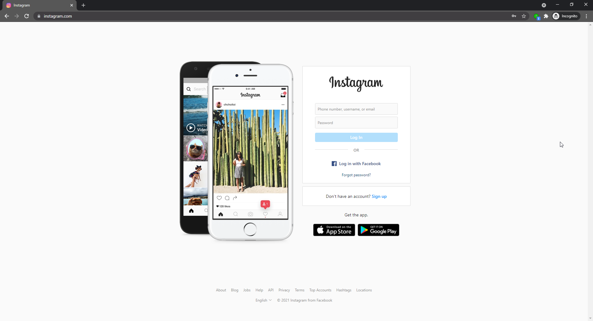
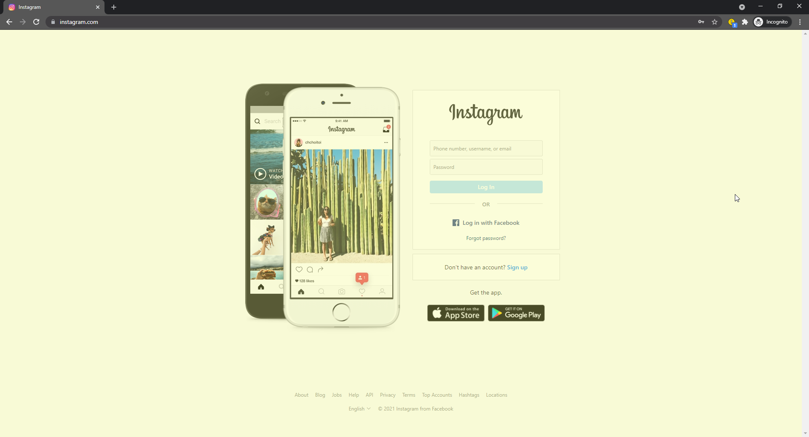
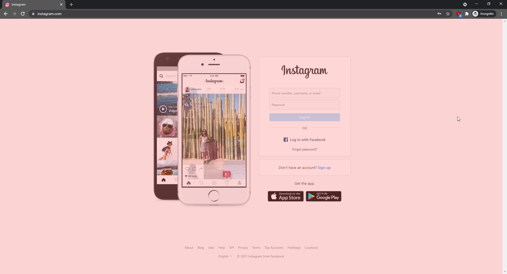
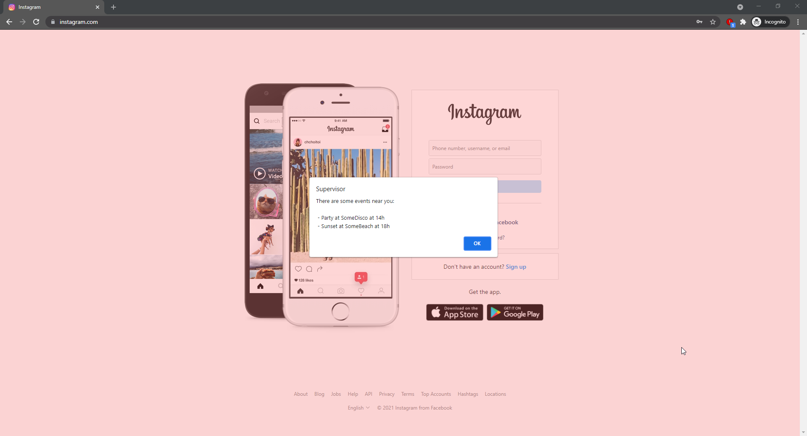
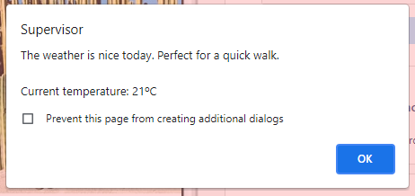
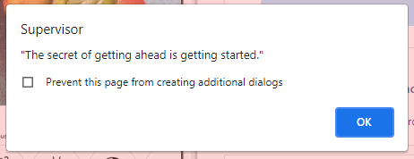

# Supervisor

Chrome plugin for tracking webpages and hopefully nudge the user to not frequent them so much.  
This extension works by adding websites to track and showing slightly uncomfortable filters on top of the page after browsing any of these pages for a while, with the intent of encouraging the user to close them on his own. When the time limit is reached, it display preset messages along with the current weather conditions or nearby public events (after the implementation of an API like that of Facebook Events).
  

## Screenshots:  

  
  
  
  
  
  
  
  

